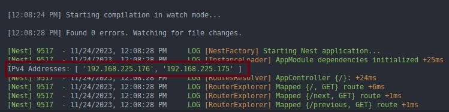

## Description

a tool to switch in slides of power point in presentation via your phone instead of pressing right or left key on laptop, but you press them on your phone so you can walk and talk change slide whenever wanted.

## Prerequisite :

1.make sure you have node.js installed on your computer that you want to present with.

2.the computer running power point and your phone that you want to swich in slids should connect to same network.(make sure they aren't using VPNs)

## Installation

```
git clone https://github.com/khalvai/slideSwitcher.git slideSwitcher
```

```
cd slideSwitcher
```

```bash
$ npm install
```

## Running the app

```bash
$ npm run start:dev
```

now slideSwitcher is running fine on port : `3000` and you will see your computer ip address :



you can access in your computer that running sliderSwithcer :

```url
localhost:3000
```

in your phone browser you should try one of the IP's that's logged on console (in this case):

```url
192.168.255.176:3000
```


and you will see this page on your phone :


and now on your computer presnt power point and switch via phone :)

## License

slideSwitcher is [MIT licensed](LICENSE).
